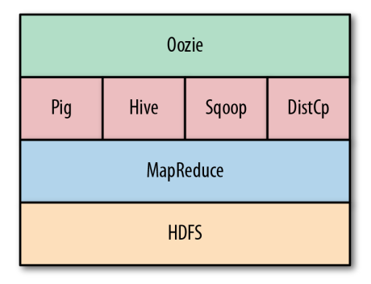

---
title:关于oozie
---

[更多信息https://blue-shadow.top/](https://blue-shadow.top/)

[更多信息在Github上:https://github.com/Shadow-Hunter-X](https://github.com/Shadow-Hunter-X)

## 背景

Hadoop、Pig、Hive和许多其他项目为存储和提供了基础以有效的方式处理大量的数据。但是大多数情况下，不可能使用一个MapReduce、Pig或Hive作业执行所有必需的处理。
多个MapReduce、Pig或Hive作业通常需要链接在一起，才能产生使用中间数据并协调它们的执行流，并且随着进行更多复杂的处理，简单的编写脚本来协调数据流已经是不可行的，并且对于
错误查找和日志追踪都很难开展。

所以oozie在这样的背景下诞生。

Oozie是Hadoop作业的编制系统。Oozie被设计成作为单个作业运行多阶段Hadoop作业。Oozie作业可以配置为运行,按需或定期。按需运行的Oozie作业称为工作流作业。
定期运行的Oozie作业称为协调器作业。还有第三种类型叫做捆绑作业的Oozie作业。捆绑作业是作为单个作业管理的协调器作业的集合。

## oozie版本

* 1.x  : 支持工作流(workflow)作业
* 2.x  : 对协调器工作(coordinator)的支持
* 3.x  : 对捆绑作业(bundle)的支持
* 4.x  : Hive/HCatalog集成，Oozie服务器高可用性，并支持服务级别协议通知