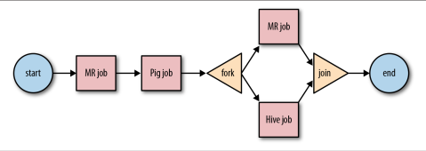
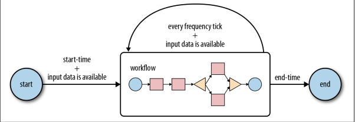
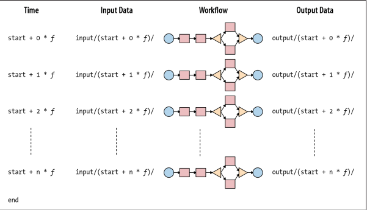

---
title：oozie相关概念
---

## Oozie 应用程序

Oozie应用程序-类似Unix可执行程序，Oozie作业-类似于Unix进程。

## Oozie 工作流（workflow）

Oozie工作流是一个多阶段的Hadoop作业。工作流是操作的集合以及以捕获控制的有向无环图(DAG)形式排列的控制节点依赖项，其中每个操作通常是Hadoop作业(例如，MapReduce、Pig、
Hive、Sqoop或Hadoop DistCp作业)。也可以有非Hadoop的操作作业(例如，Java应用程序、shell脚本或电子邮件通知)。

工作流中节点的顺序决定了这些节点的执行顺序行动。直到工作流中的前一个操作结束，操作才开始。工作流中的控制节点用于管理操作的执行流，开始和结束控制节点定义工作流的开始和结束。分叉和联接
控制节点允许并行执行操作。决策控制节点类似于switch/case语句,可以使用作业本身的信息选择工作流中的特定执行路径。

## Oozie 协调器（Coordinators）
Oozie协调器根据启动时间和频率参数来调度工作流执行，并在所有必要的输入数据时启动工作流时是可用的。如果输入数据不可用，工作流执行就会延迟
直到输入数据可用为止。协调器由开始和结束定义时间、频率、输入和输出数据，以及工作流。协调器从开始到结束定期运行。

从启动时开始，协调器作业检查所需的输入数据是否为可用。当输入数据可用时，将启动工作流来处理输入数据在完成时生成相应的输出数据。
如果输入数据不能用于工作流运行，则工作流作业的执行将被延迟，直到输入数据可用为止。通常情况下,这两个用于工作流执行的输入和输出数据与协调器保持一致时间频率

## Oozie 绑定作业（Bundles）

Oozie bundles 是协调器作业（Coordinators）的集合，可以作为单个作业启动、停止、挂起和修改。通常，bundle中的协调器作业取决于
各协调器作业互相间的关系。协调器作业生成的输出数据成为输入数据其他协调员的输出数据。这些类型的相互依赖的协调器工作也是被称为数据管道。

## 参数，变量和函数

* 参数-Parameters

* 变量-Variables

* 函数-Functions